<p align="center">
  <a href="https://sattiyans.com">
    
  </a>
</p>

# 👋 Hi there, I'm Sattiyan (@sattiyans)

💻 **Technology Lead @ G6 Labs Asia** | 🚀 **Founder @ Dotkod Solutions** | 🤖 **GenAI & Automation**

📍 Kuala Lumpur, Malaysia · Remote-friendly · Open to freelance engagements

I take SaaS products from **architecture through production** — designing fault-tolerant, event-driven systems and GenAI workflows with **Laravel, Node.js, and Python**. I lead engineering standards, own technical roadmaps, and build platforms meant to scale without breaking under real traffic.

Currently shipping production platforms at **G6 Labs Asia**, while running **[Dotkod Solutions](https://dotkod.com)** — custom web apps, e-commerce, and proprietary AI systems for startups and SMEs, from scoping to deployment.

```text
7+ yrs shipping production software   ·   20+ projects shipped
SaaS · AI · payment integrations     ·   Zero-downtime, event-driven architecture
```

---

## 🌟 What I Do Best
- **SaaS architecture** → Event-driven backends, multi-tenant systems, platforms built for real traffic
- **GenAI automation** → OpenAI, n8n, and custom pipelines that cut repetitive manual ops
- **Payment & API integrations** → Stripe, CHIP, Spayz, Amopay & custom international gateways + webhooks
- **Product engineering** → Full-stack delivery from scoping and UI through APIs, data models, deployment
- **Admin dashboards** → Internal ops tools, reporting panels, workflow UIs for teams at scale
- **Freelance consulting** → Scoped builds for startups & SMEs — discovery through production

---

## 🚀 Shipped Products
- **GBoost.ai** & **GSendr** — production platforms @ G6 Labs Asia
- **FEMO**, **Invested** & sports web apps — @ TriSquare Technology
- Plus 20+ client builds via Dotkod (SaaS, e-commerce, AI integrations)

> Started in game dev with **Unreal Engine** & **Unity** — those projects still live on [itch.io](https://sattiyans.itch.io/).

---

## 🧰 Tech Toolbox


---

## 📊 GitHub Stats


---

## 🌐 Let's Connect

[](https://sattiyans.com)
[](mailto:hey@sattiyans.com)
[](https://linkedin.com/in/sattiyans)
[](https://x.com/sattiyans)
[](https://dotkod.com)

<sub>🚀 [Dotkod](https://dotkod.com) — crafting digital solutions with excellence.</sub>
